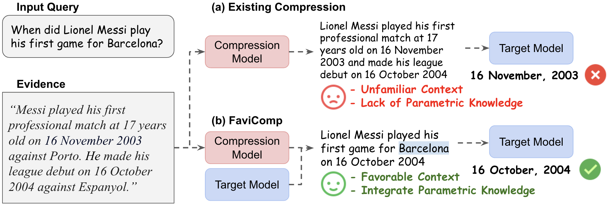

# Familiarity-aware Evidence Compression for Retrieval Augmented Generation
We propose [FaviComp (**Fa**miliarity-aware E**vi**dence **Comp**ression)](https://arxiv.org/abs/2409.12468), a novel training-free evidence compression technique that makes retrieved evidence more familiar to the target model, while seamlessly integrating parametric knowledge from the model. 



## Installation
```bash
conda create -n favicomp python=3.12
conda activate favicomp
pip install -r requirements.txt
```

## Data
Data can be download in this [link](https://drive.google.com/drive/folders/1UbWDfb7Bi6Vza2DvKB-bi0TgmxpB4xSY?usp=drive_link). Place `data/` under root directory. 

## Run FaviComp
Example script for NQ dataset with the compression and target model being Llama-3-8B-Instruct. Make sure the both compression and target model has the same tokenizer. Change the parameters to run on other datasets and models. 
```bash
python main.py \
--model_name meta-llama/Meta-Llama-3-8B-Instruct \
--target_model_name meta-llama/Meta-Llama-3-8B-Instruct \
--alpha 0.5 \
--batch_size 28 \
--dataset nq 
```
- `model_name`: Compression model name ('meta-llama/Meta-Llama-3-8B-Instruct' or 'mistralai/Mistral-7B-Instruct-v0.3')
- `target_model_name`: Target model name (Use same model as `model_name` to reproduce our work)
- `alpha`: Ensemble coefficient alpha
- `dataset`: Dataset ('nq', 'tqa', 'hotpotqa', 'wiki', 'musique')

## Evaluation
After running FaviComp, run performance evaluation script below using the same parameters. 
```bash
python evaluate.py \
--model_name meta-llama/Meta-Llama-3-8B-Instruct \
--target_model_name meta-llama/Meta-Llama-3-8B-Instruct \
--alpha 0.5 \
--dataset nq 
```

Calculate perplexity of the compressed evidence using the script below.
```bash
python eval_ppl.py \
--model_name meta-llama/Meta-Llama-3-8B-Instruct \
--target_model_name meta-llama/Meta-Llama-3-8B-Instruct \
--alpha 0.5 \
--dataset nq 
```